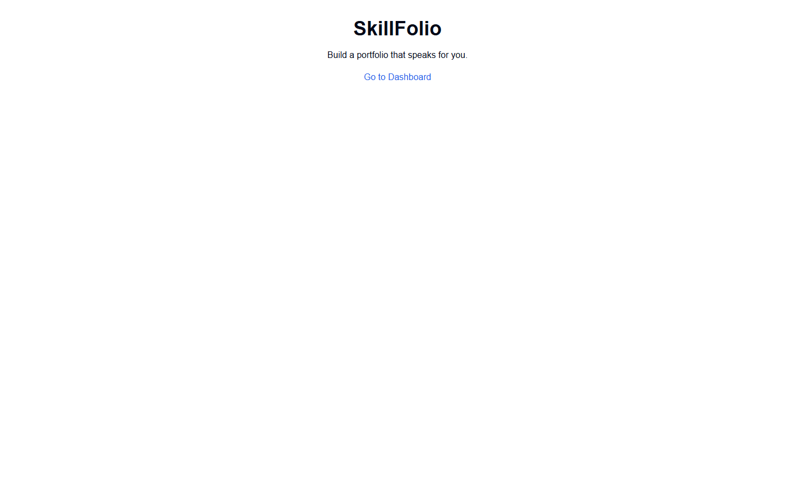
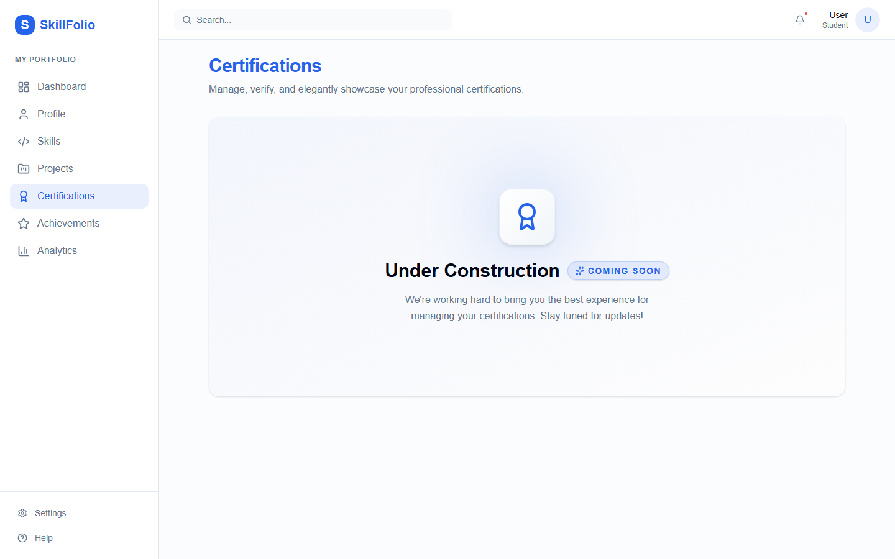
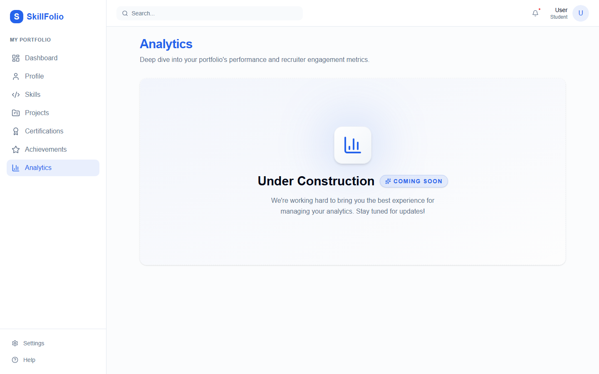
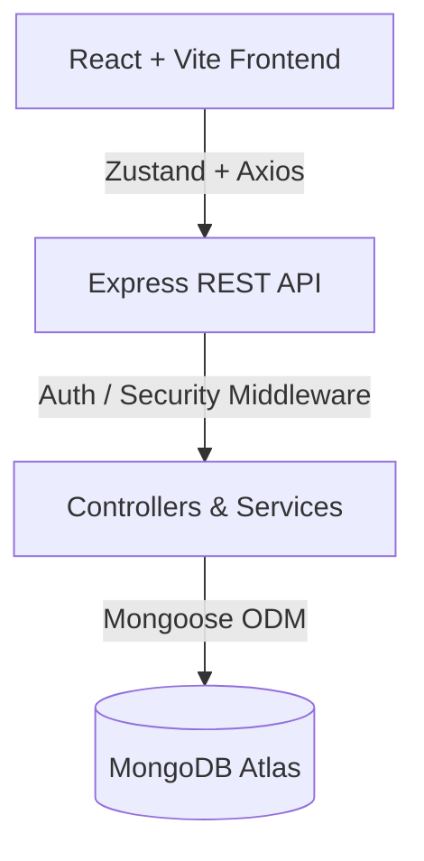

# SkillFolio – Student Skill Portfolio Platform

SkillFolio is a modern digital portfolio platform that empowers students to centrally manage and showcase their skills, projects, certifications, achievements, and supporting evidence. 

**BUILD → PROVE → SHOW**
* Build skills through projects and continuous learning
* Prove skills by linking concrete projects and certifications as evidence
* Show skills through a dynamically generated, professional public portfolio

---

## 2. Problem Statement

> Build a digital portfolio where students can maintain their skills, projects, certifications and achievements. Students should be able to add, edit and organize their portfolio information. The portfolio should present a student’s technical or other relevant skills along with supporting projects or certificates. The system should make the information easy to view and update.

**The Practical Problem:** 
Students often have their achievements distributed across scattered resumes, GitHub profiles, hard-drive certificates, hackathon websites, and college portals. This fragmentation makes it difficult to maintain a single structured representation of their abilities and provide verifiable evidence for those skills. 

**The SkillFolio Solution:**
SkillFolio centralizes this information into one beautifully organized platform, ensuring that every claimed skill is backed by real, verifiable evidence.

---

## 3. Skills + Evidence (Key USP)

SkillFolio does not simply allow students to list isolated skills. Instead, every skill acts as a central hub that can be connected to concrete supporting evidence, such as:
* Projects
* Certifications
* Achievements

For example:
**React**
→ GROUPS.BIT (Project)
→ Fashion Recommendation Engine (Project)
→ Frontend Developer Certificate (Certification)

This interconnected evidence graph is the core differentiating feature of the platform, allowing recruiters to see exactly *how* a student acquired and used a specific skill.

---

## 4. Features

### Student Profile
* Personal information management
* Professional title & Bio
* Education details (College, Degree, Graduation Year)
* GitHub, LinkedIn, and Portfolio URL integration
* Location & Contact details

### Skills
* Add, Edit, and Delete skills
* Categorize skills (e.g., Frontend, Cloud, AI/ML)
* Track proficiency levels and years of experience
* Link skills directly to concrete evidence

### Projects
* Add, Edit, and Delete projects
* Track technologies used
* Rich project descriptions
* GitHub and Live URL integration
* Feature specific projects on the public portfolio
* Connect projects directly to the skills they utilize

### Certifications
* Add, Edit, and Delete certifications
* Track Issuing Organizations and issue/expiry dates
* Credential URLs
* Direct certification-to-skill linking

### Achievements
* Add, Edit, and Delete achievements
* Track achievement categories (Hackathon, Competition, Academic, etc.)
* Dates, organization, and rich descriptions

### Portfolio
* Auto-generated public portfolio based on username
* Shareable portfolio links
* Granular Public/Private visibility toggles for every entity (Skills, Projects, etc.)

### Analytics
* Comprehensive portfolio statistics (total counts)
* Evidence coverage metrics
* Dynamic portfolio strength calculation
* Actionable AI-free recommendations to improve portfolio completeness

### Authentication
* Secure registration and login
* Protected private dashboard routes
* Secure logout mechanisms
* HTTP-only JWT cookies

---

## 5. Screenshots

### Landing Page
A clean introduction to the platform for new users.


### Dashboard
The dashboard provides a high-level overview of the student's portfolio, including skills, projects, certifications, achievements, and recent activity.


### Profile Management
Allows students to manage their personal information, bio, social links, and educational background.


### Skills & Evidence
Displays all skills with their respective proficiency levels, categories, and dynamically calculated evidence coverage.


### Projects
A gallery of the student's projects, showcasing technologies used and the specific skills each project proves.


### Certifications
A dedicated space to track verified certifications, issuing organizations, and credential links.


### Achievements
A timeline of the student's hackathons, competitions, and technical contributions.


### Analytics & Insights
Visualizes the student's skill distribution and portfolio strength, providing actionable recommendations to improve their profile.


### Public Portfolio
The clean, recruiter-facing public portfolio that dynamically compiles all public skills, projects, and evidence into a shareable link.


---

## 6. Tech Stack

### Frontend
* **React** + **Vite** (Build Tool)
* **TypeScript**
* **React Router DOM** (Routing)
* **Tailwind CSS** + **shadcn/ui** (Styling & Components)
* **Lucide React** (Icons)
* **Framer Motion** (Animations)
* **Recharts** (Data Visualization)
* **Zustand** (State Management)

### Backend
* **Node.js** + **Express.js** (REST API)
* **MongoDB** + **Mongoose** (Database & ODM)
* **JWT** (JSON Web Tokens via HTTP-only cookies)
* **bcryptjs** (Password hashing)

### Development/Security
* **dotenv** (Environment variables)
* **CORS** (Cross-origin resource sharing)
* **Helmet** (HTTP header security)
* **Morgan** (Request logging)

---

## 7. System Architecture



**Data Flow:**
```text
React UI (shadcn/ui)
   ↓
Zustand Store (usePortfolioStore)
   ↓
Axios API Client
   ↓
Express REST API (Routes)
   ↓
Controllers (Business Logic & Ownership Validation)
   ↓
Mongoose Models (Validation & Relationships)
   ↓
MongoDB (Persistence)
```

---

## 8. Project Structure

```text
SkillFolio/
├── client/
│   ├── src/
│   │   ├── assets/
│   │   ├── components/      # Reusable UI components (shadcn)
│   │   ├── data/            # Fallback mock data structures
│   │   ├── layouts/         # Dashboard & Auth layouts
│   │   ├── pages/           # Page views (Dashboard, Skills, etc.)
│   │   ├── services/        # Axios API client integrations
│   │   ├── store/           # Zustand state management
│   │   ├── types/           # TypeScript interfaces
│   │   └── App.tsx
│   ├── .env
│   └── package.json
│
├── server/
│   ├── src/
│   │   ├── config/          # DB connection
│   │   ├── controllers/     # Route logic (Auth, Skills, Analytics, etc.)
│   │   ├── middleware/      # JWT verification & Error handlers
│   │   ├── models/          # Mongoose Schemas
│   │   ├── routes/          # Express Routers
│   │   ├── services/        # Scoring & Recommendation logic
│   │   ├── seed/            # Database initialization script
│   │   └── server.js        # Express entry point
│   ├── .env
│   └── package.json
│
├── docs/
│   └── screenshots/         # Documentation images
│
└── README.md
```

---

## 9. Setup and Installation

### Prerequisites
* **Node.js** (v18+)
* **npm** (v9+)
* **MongoDB Atlas** account (or local MongoDB instance)
* **Git**

### 1. Clone the Repository
```bash
git clone https://github.com/HARIPRASAT-VS/skill-portfolio.git
cd skill-portfolio
```

### 2. Backend Setup
```bash
cd server
npm install
```

### 3. Frontend Setup
Open a new terminal window:
```bash
cd client
npm install
```

---

## 10. Environment Variables

Create `.env` files in both the `server` and `client` directories.

### `server/.env`
```env
PORT=5000
NODE_ENV=development
MONGO_URI=your_mongodb_connection_string
JWT_SECRET=your_super_secret_jwt_key
CLIENT_URL=http://localhost:5173
```

### `client/.env`
```env
VITE_API_URL=http://localhost:5000/api
VITE_USE_MOCK_DATA=false
```

*(Note: Never commit your actual `MONGO_URI` or `JWT_SECRET` to version control).*

---

## 11. Database Seeding

To quickly populate the database with a rich, interconnected demo profile (Hariprasat V.S.), run the included seed script:

```bash
cd server
npm run seed
```

This script safely connects to MongoDB, clears previous data, and creates:
* 1 Demo Student (`demo@skillfolio.dev` / `Demo@12345`)
* 12 Skills
* 6 Projects
* 4 Certifications
* 8 Achievements
* Complete skill-to-evidence relationships

The seed script is idempotent and prevents data duplication.

*(Note: If deploying to a cloud service like Render, you can also trigger the seed via the `GET /api/seed` endpoint).*

---

## 12. Running the Application

Once the database is seeded, start the development servers:

**Terminal 1 (Backend)**
```bash
cd server
npm run dev
```

**Terminal 2 (Frontend)**
```bash
cd client
npm run dev
```

The application will be accessible at:
* **Frontend UI**: `http://localhost:5173`
* **Backend API**: `http://localhost:5000`

---

## 13. API Overview

The backend provides a comprehensive RESTful API.

### Authentication
* `POST /api/auth/register` - Register a new student
* `POST /api/auth/login` - Authenticate and receive HTTP-only JWT
* `POST /api/auth/logout` - Clear authentication cookie
* `GET  /api/auth/me` - Retrieve current authenticated user

### Profile
* `GET /api/profile` - Get student profile
* `PUT /api/profile` - Update profile details

### Skills
* `GET    /api/skills` - Get all skills
* `POST   /api/skills` - Add a new skill
* `PUT    /api/skills/:id` - Update a skill
* `DELETE /api/skills/:id` - Delete a skill

### Projects, Certifications, and Achievements
All follow standard CRUD patterns:
* `GET    /api/<entity>`
* `POST   /api/<entity>`
* `PUT    /api/<entity>/:id`
* `DELETE /api/<entity>/:id`

### Analytics & Portfolio
* `GET /api/analytics` - Get aggregated dashboard metrics, charts, and recommendations
* `GET /api/portfolio/:username` - Get a student's public portfolio data (filters out private entities)
* `GET /api/seed` - Cloud seeding endpoint

---

## 14. Portfolio Strength & Recommendations

### Portfolio Strength
The platform dynamically calculates a "Portfolio Strength" score based on data completeness and evidence density. The score increases as students:
* Complete their profile bio and links
* Add skills
* Provide evidence (projects/certifications) for claimed skills
* Log achievements

### Actionable Recommendations
The `recommendationService` analyzes the student's database records and provides rule-based suggestions, such as:
* *"Your Python skill has no supporting project or certification. Add evidence!"*
* *"Add your GitHub profile link."*
* *"Consider adding more projects to demonstrate your 12 skills."*

---

## 15. Security

SkillFolio implements industry-standard security measures:
* **Password Hashing**: All passwords are encrypted via `bcryptjs` before storage.
* **JWT Authentication**: Sessions are managed via secure, HTTP-only cookies, preventing XSS token theft.
* **Data Ownership**: Every private document (Skill, Project, etc.) stores a `user: ObjectId`. Controllers explicitly verify ownership on every `PUT` and `DELETE` request.
* **Middleware**: `helmet` is used for HTTP header security, and `cors` is strictly configured to the frontend domain.
* **Public/Private Granularity**: Students can toggle the visibility of individual skills and projects, ensuring the public `GET /api/portfolio/:username` endpoint never leaks private data.

---

## 16. Future Scope

* AI-powered resume parsing and automatic skill extraction
* Recruiter dashboards for searching student portfolios
* Automated GitHub repository syncing for projects
* Built-in skill verification assessments

---

## 17. Demo Flow

To demonstrate the full capability of the platform:
1. Navigate to the **Landing Page** and proceed to **Login** (`demo@skillfolio.dev` / `Demo@12345`).
2. Review the aggregated metrics on the **Dashboard**.
3. Go to **Skills** and observe the "Evidence Coverage" and "Recommendations".
4. Go to **Projects**, add a new project, and link it to an existing skill.
5. Return to **Skills** to see the evidence dynamically updated.
6. Open the **Public Portfolio** to view the final, shareable, recruiter-facing presentation.

---

**Status:** Working MVP / Complete MERN Stack Implementation